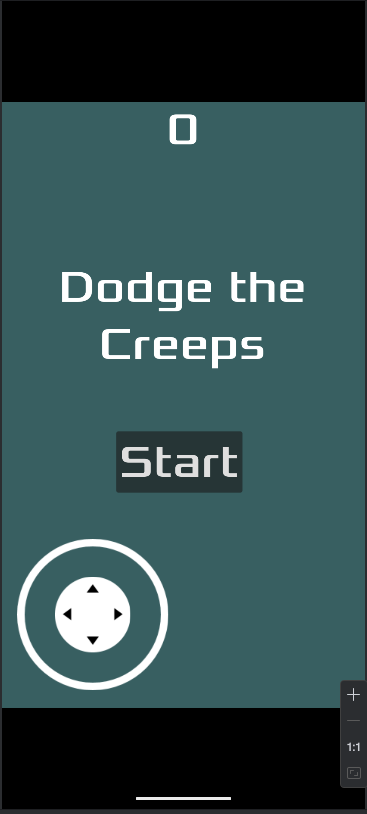

# flutter_godot_bridge

Flutter godot integration

## Getting Started

## Demo Screenshots

| Flutter UI |
|------------|
|  | 

---

| Godot Game | Godot Start | Godot End | 
|------------|-------------|-----------|
|  |  |  |

# Flutter Godot Bridge

Flutter package for Godot game engine integration.

Overview: Embed Godot games inside Flutter apps for rich interactive experiences on Android and iOS.

Features: Bidirectional communication between Flutter and Godot, embedding Godot scenes as Flutter widgets, and control customization.

Installation: Add the package to Flutter, set up Godot export templates, and configure native Android/iOS settings.

Usage: Simple Dart code to embed Godot, example Godot signals, and game lifecycle management.

Architecture: Flutter UI layer communicates with native Godot engine via a bridge using JNI/FFI or platform channels.

Performance: Tips on optimizing load times and managing memory.

Known Limitations: Current issues with platform quirks and future improvements.

Contributing: How to help improve the bridge and contribution guidelines.

References: Links to Flutter, Godot docs, and integration tutorials.

For help getting started with Flutter development, view the
[online documentation](https://docs.flutter.dev), which offers tutorials,
samples, guidance on mobile development, and a full API reference.

