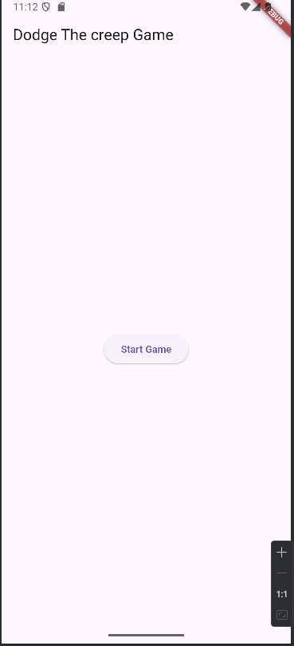
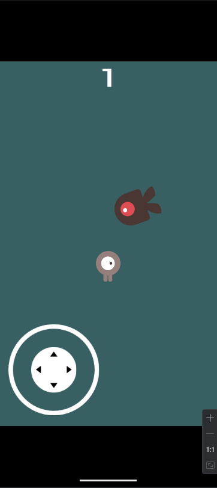
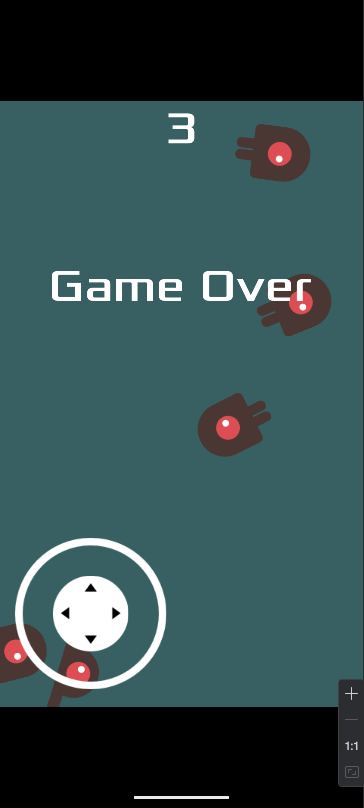

# flutter_godot_bridge

Flutter godot integration

## Getting Started

## Demo Screenshots

| Flutter UI |
|------------|
|  | 

---

| Godot Game | Godot Start | Godot End | 
|------------|-------------|-----------|
|  |  |  |

# Flutter Godot Bridge

Flutter package for Godot game engine integration.

## Features
- Embed Godot games in Flutter apps
- Bidirectional communication
- Android/iOS support

## Installation

This project is a starting point for a Flutter
[plug-in package](https://flutter.dev/to/develop-plugins),
a specialized package that includes platform-specific implementation code for
Android

For help getting started with Flutter development, view the
[online documentation](https://docs.flutter.dev), which offers tutorials,
samples, guidance on mobile development, and a full API reference.

